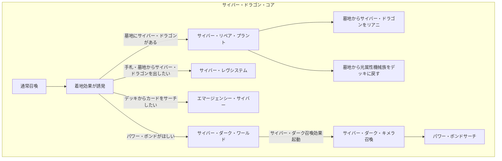
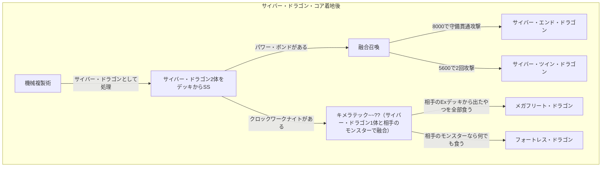
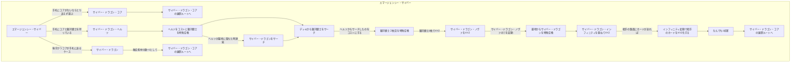
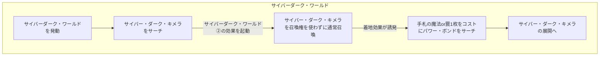
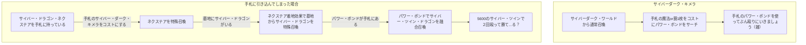

# サイバー・ドラゴンデッキ
## はじめに
どっからでも相手のライフを直葬できる出力の高さが売りの後攻ワンキルが狙えるデッキ。 起点になるのは小粒の「俺サイバー・ドラゴンっす」なカード達。もともと「サイバー」と名前のついたカードであるため、豊富なサポートカードからサーチが可能であり、サイバー・ドラゴンであれば融合の起点になることを忘れずにいよう。

特に《キメラテック・フォートレス・ドラゴン》や《キメラテック・メガフリート・ドラゴン》のように融合を必要とせず、相手の機械族モンスターを巻き込みながら融合召喚することで、相手の盤面を壊してライフを直接削りに行ける仕組みがほんっっっっっっとうに強い。

「相手が機械族デッキじゃなかったらこの強みってなくない？？」

そんな声が聞こえてきそうだが、《機械仕掛けの夜-クロックワークナイト》がすべてを解決してくれる。

あと以降のやつは[タクティカルトライデッキのリスト](https://www.yugioh-card.com/japan/products/tt01a/)を前提としている。
## 起点になりそうなカード
### サイバー・ドラゴン・コア
|イラスト|効果|
|---|---|
||星２/光属性/機械族/攻 400/守1500 このカード名の②③の効果は１ターンに１度、いずれか１つしか使用できない。 ①：このカードのカード名は、フィールド・墓地に存在する限り「サイバー・ドラゴン」として扱う。 ②：このカードが召喚に成功した場合に発動する。 デッキから「サイバー」魔法・罠カードまたは「サイバネティック」魔法・罠カード１枚を手札に加える。 ③：相手フィールドにのみモンスターが存在する場合、墓地のこのカードを除外して発動できる。 デッキから「サイバー・ドラゴン」モンスター１体を特殊召喚する|

このカードができることは以下の通り。
- サイバー・ドラゴンとして扱えること。
  - サイバー・ドラゴンであることから、機械複製術でデッキからサイバー・ドラゴン2体をSSできる。
- ETBでサイバー/サイバネティック魔法罠をサーチできること。
- 相手のモンスターのみが存在する場合に墓地から除外することでサイバー・ドラゴンをSSできること。

ここまでで言えることをまとめるとこんな感じ。

あとフィールドと墓地にいるときは①の効果でサイバー・ドラゴンとして扱えるので、キメラテック・ランページやらのコストにできたり、サイバー・ドラゴン・ズィーガーを出すためのリンク素材になったりもする（本当に重要）。

### エマージェンシー・サイバー
|イラスト|テキスト|
|---|---|
||このカード名のカードは１ターンに１枚しか発動できない。 ①：デッキから「サイバー・ドラゴン」モンスターまたは通常召喚できない機械族・光属性モンスター１体を手札に加える。 ②：相手によってこのカードの発動が無効になり、このカードが墓地へ送られた場合、手札を１枚捨てて発動できる。このカードを手札に加える。|

大体うららが飛んでくるカード筆頭候補（コアよりもこっちに飛んでくるイメージ）。基本的に以下の3卓ぐらいになる。
1. サイバー・ドラゴン・コア: 最優先のサーチ先。
2. サイバー・ドラゴン・ヘルツ: 手札にコアが存在する状況かつ銀河戦士が手札にあるときのコストにするとサイバー・ドラゴンをサーチできて手札ロスが発生しない。
3. サイバー・ドラゴン: 後攻展開でコアが手札にあるとき、最初のSSに使ったり。

ざっくりまとめるとこれか。

### サイバーダーク・ワールド
|イラスト|テキスト|
|---|---|
||このカード名のカードは１ターンに１枚しか発動できず、このカード名の②の効果は１ターンに１度しか使用できない。 ①：このカードの発動時の効果処理として、同名カードが自分の墓地に存在しない「サイバー・ダーク」モンスター１体をデッキから手札に加える事ができる。 ②：自分メインフェイズに発動できる。「サイバー・ダーク」モンスター１体の召喚を行う。 ③：「サイバー・ダーク」モンスターの召喚・特殊召喚成功時に発動する自身の効果で、自分が自分の墓地からモンスターを装備する場合、代わりに相手の墓地から装備する事もできる。|

基本的にサイバー・ダーク・キメラをサーチするために利用するカード。サーチ後にそのまま効果で通常召喚できるのが偉いポイント。もし対面に置かれたらサーチ効果にチェインしてサイクロンとかで破壊できればサイバー・ダーク・キメラの召喚までは止めることができる（②効果の発動タイミングはチェーン1でなければならないため）。

タクティカルトライデッキとしては③の効果はインクのシミと化しているのでスルーで問題ない。

### サイバー・ダーク・キメラ
|イラスト|テキスト|
|---|---|
||このカード名の①②の効果はそれぞれ１ターンに１度しか使用できない。 ①：手札から魔法・罠カード１枚を捨てて発動できる。デッキから「パワー・ボンド」１枚を手札に加える。このターン、自分はドラゴン族・機械族の「サイバー」モンスターしか融合素材にできず、自分がモンスターを融合召喚する場合に１度だけ、自分の墓地のモンスターを除外して融合素材とする事もできる。 ②：このカードが墓地へ送られた場合に発動できる。同名カードが自分の墓地に存在しない「サイバー・ダーク」モンスター１体をデッキから墓地へ送る。|

基本的にパワー・ボンドをサーチするためのカードと言っても過言ではないやつ。ただ墓地にいるときに融合素材を墓地から除外する形で供給できる能力がマジでつよすぎる。サイバーダーク・ワールドから通常召喚しているのであれば、墓地に送るためにアルミラージをリンク召喚する選択肢もある。

またこのカード1枚から動くことはとても難しく、手札に引き込んでしまった場合はほぼ役割は無いといっても過言ではない。このため1枚採用とするケースとなりそう。
念の為引き込んでしまった場合のルートも記すが、要求される状況が後攻１ターン目の盤面とは言えないので頭の隅にいれるぐらいの認識でいたい。

## 参考文献
1. 遊戯王OCGデュエルモンスターズ TACTICAL-TRY DECK 終撃竜サイバー・ドラゴン | 商品情報 - https://www.yugioh-card.com/japan/products/tt01a/
1. 遊戯王カードwiki - https://yugioh-wiki.net/
1. 遊戯王 オフィシャルカードゲーム デュエルモンスターズ - カードデータベース - https://www.db.yugioh-card.com/yugiohdb/
