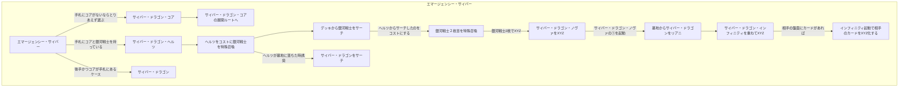

# サイバー・ドラゴンデッキ
## はじめに
どっからでも相手のライフを直葬できる出力の高さが売りの後攻ワンキルが狙えるデッキ。 起点になるのは小粒の「俺サイバー・ドラゴンっす」なカード達。もともと「サイバー」と名前のついたカードであるため、豊富なサポートカードからサーチが可能であり、サイバー・ドラゴンであれば融合の起点になることを忘れずにいよう。

特に《キメラテック・フォートレス・ドラゴン》や《キメラテック・メガフリート・ドラゴン》のように融合を必要とせず、相手の機械族モンスターを巻き込みながら融合召喚することで、相手の盤面を壊してライフを直接削りに行ける仕組みがほんっっっっっっとうに強い。

「相手が機械族デッキじゃなかったらこの強みってなくない？？」

そんな声が聞こえてきそうだが、《機械仕掛けの夜-クロックワークナイト》がすべてを解決してくれる。

## 起点になりそうなカード
### サイバー・ドラゴン・コア
|イラスト|効果|
|---|---|
||星２/光属性/機械族/攻 400/守1500 このカード名の②③の効果は１ターンに１度、いずれか１つしか使用できない。 ①：このカードのカード名は、フィールド・墓地に存在する限り「サイバー・ドラゴン」として扱う。 ②：このカードが召喚に成功した場合に発動する。 デッキから「サイバー」魔法・罠カードまたは「サイバネティック」魔法・罠カード１枚を手札に加える。 ③：相手フィールドにのみモンスターが存在する場合、墓地のこのカードを除外して発動できる。 デッキから「サイバー・ドラゴン」モンスター１体を特殊召喚する|

このカードができることは以下の通り。
- サイバー・ドラゴンとして扱えること。
  - サイバー・ドラゴンであることから、機械複製術でデッキからサイバー・ドラゴン2体をSSできる。
- ETBでサイバー/サイバネティック魔法罠をサーチできること。
- 相手のモンスターのみが存在する場合に墓地から除外することでサイバー・ドラゴンをSSできること。

ここまでで言えることをまとめるとこんな感じ。

あとフィールドと墓地にいるときは①の効果でサイバー・ドラゴンとして扱えるので、キメラテック・ランページやらのコストにできたり、サイバー・ドラゴン・ズィーガーを出すためのリンク素材になったりもする（本当に重要）。

### エマージェンシー・サイバー
|イラスト|テキスト|
|---|---|
||このカード名のカードは１ターンに１枚しか発動できない。 ①：デッキから「サイバー・ドラゴン」モンスターまたは通常召喚できない機械族・光属性モンスター１体を手札に加える。 ②：相手によってこのカードの発動が無効になり、このカードが墓地へ送られた場合、手札を１枚捨てて発動できる。このカードを手札に加える。|

大体うららが飛んでくるカード筆頭候補（コアよりもこっちに飛んでくるイメージ）。基本的に以下の3卓ぐらいになる。
1. サイバー・ドラゴン・コア: 最優先のサーチ先。
2. サイバー・ドラゴン・ヘルツ: 手札にコアが存在する状況かつ銀河戦士が手札にあるときのコストにするとサイバー・ドラゴンをサーチできて手札ロスが発生しない。
3. サイバー・ドラゴン: 後攻展開でコアが手札にあるとき、最初のSSに使ったり。

ざっくりまとめるとこれか。

## 参考文献
1. [遊戯王カードwiki](https://yugioh-wiki.net/)
1. [遊戯王 オフィシャルカードゲーム デュエルモンスターズ - カードデータベース](https://www.db.yugioh-card.com/yugiohdb/)